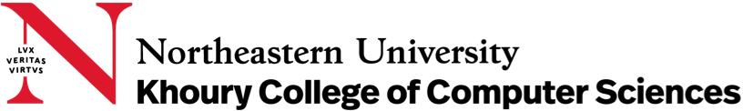

  
  
  

# CS6220 - Data Mining Techniques | _Fal 2023_

This repository contains supporting material to the Data Mining Technique course being taught in the Fall of 2023.  For the most part, the material you will find here is made up of Jupyter Notebooks that will be covered in class, and that illustrate Python implementations of some of the concepts we will discuss. These files will also serve as reference for some homework assignments.

## The course Slack Page

All communication/announcements related to the course will be done via Slack. As a registered student, you should have access to our Slack page [here](https://cs6220fall2023.slack.com/).

## Instructor and TAs

**Everaldo Aguiar** (e.aguiar@northeastern.edu) is the course instructor.

**Vrinda Bisani** (bisani.v@northeastern.edu) and **Qingzhao Li** (li.qingz@northeastern.edu) are the course TAs.

If you come across any questions, feel  free to reach out to them directly on Slack.

## TA hrs

* TBD

## Acknowledgments

A large portion of the code snippets that are provided here were adapted from material that is freely available online. As such, you are strongly encouraged to review these (and any other relevant sources you may find) if you wish to improve your Python skills.

* [Official scikit-learn Examples](http://scikit-learn.org/stable/auto_examples/)
* [Official pandas Tutorials](http://pandas.pydata.org/pandas-docs/version/0.18.1/tutorials.html)
* [Donne Martin's Data Science Python Notebooks](https://github.com/donnemartin/data-science-ipython-notebooks)
* [Official Materials and Notebooks for "Python for Data Analysis" by Wes McKinney](https://github.com/wesm/pydata-book)
* [Official Materials and Notebooks for "Python Data Science Handbook" by Jake VanderPlas](https://github.com/jakevdp/PythonDataScienceHandbook)
* [Materials and Notebooks for "Programming Collective Intelligence" By Toby Segaran](https://github.com/ferronrsmith/programming-collective-intelligence-code)# cs6620_23fall
# cs6620_23fall
